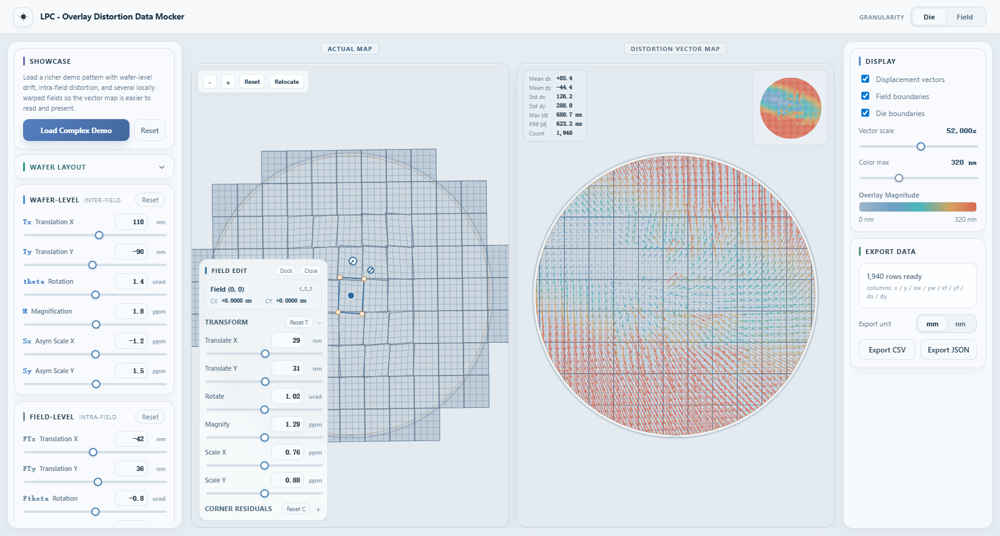
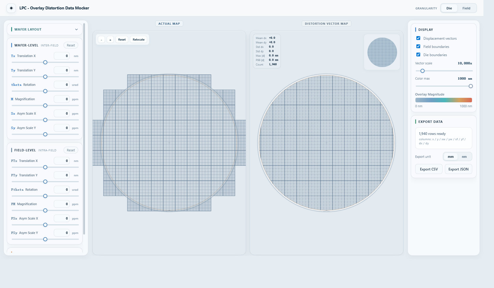
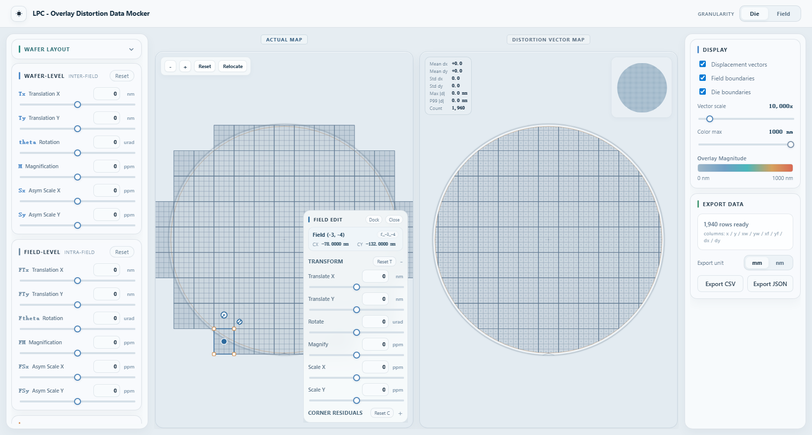

# LPC - Wafer Overlay Distortion Data Mocker

A browser-based visual sandbox for generating, inspecting, editing, and exporting wafer overlay distortion data.

`LPC Overlay Distortion Data Mocker` is designed for UI prototyping, algorithm experimentation, workflow demos, and mock data generation around wafer / field / die-level overlay behavior. It combines parametric distortion controls with an interactive wafer editor so you can move quickly between "global model" and "local exception" workflows.

> This project is a simulation and mock-data tool. It is not a fab-qualified metrology or process control system.

## Screenshots

### Showcase Demo



### Full workspace



### Interactive field editing



## Why this project exists

Overlay analysis workflows often need realistic but controllable data:

- Product teams need a believable front-end before live data pipelines exist.
- Algorithm and analytics work benefits from repeatable parametric distortions.
- Demo environments need exportable datasets in practical engineering units.
- Process exploration often needs both wafer-level trends and field-local exceptions in the same session.

This app focuses on that gap: fast visual iteration with enough geometry awareness to make the generated behavior feel useful.

## Feature Highlights

- Dual-map workspace with side-by-side `Actual Map` and `Distortion Vector Map` views.
- Built-in `Showcase` preset for loading a presentation-ready distortion scene in one click.
- Default showcase now emphasizes `die` granularity with stronger but readable vectors.
- Parametric wafer-level controls for translation, rotation, magnification, and asymmetric scaling.
- Independent field-level controls for intra-field distortion shaping.
- EPE simulation with `none`, `random`, and `systematic` modes.
- Interactive field selection directly on the wafer map.
- Floating `Field Edit` inspector with transform overrides and corner residual editing.
- Local field deformation that can create gentle, continuous warped patches instead of only rigid transforms.
- Auto-docking field editor that repositions based on selected field location.
- `Die` and `Field` granularity switching from the main header.
- Lightweight live statistics overlay on the vector map.
- Mini wafer overview inset for fast spatial context.
- Zoom, relocate, and model reset controls directly on the map surface.
- Export to `CSV` and `JSON`.
- Export unit switching between `mm` and `nm`.
- Reset model state independently from view relocation.

## Demo Preset

The `Load Complex Demo` action in the left-side `Showcase` card is intended for instant demos and screenshots.

It applies:

- A light wafer-level trend so the whole wafer still feels coherent.
- A subtle field-level contribution for intra-field texture.
- A center-weighted patch of locally warped fields to create a more interesting shape signature.
- A stronger `die`-mode vector presentation so the right-side map reads clearly at a glance.

This gives you a good "default story" for the product without having to manually tune dozens of controls before every demo.

## What You Can Model

- Wafer translation: `Tx`, `Ty`
- Wafer rotation: `theta`
- Wafer magnification / asymmetry: `M`, `Sx`, `Sy`
- Field translation: `FTx`, `FTy`
- Field rotation: `Ftheta`
- Field magnification / asymmetry: `FM`, `FSx`, `FSy`
- Edge placement error patterns with reproducible random seeds or systematic direction
- Per-field manual exceptions through direct map editing
- Per-corner residual offsets for localized shape changes
- Center-weighted warped field patches for more organic local deformation
- Two complementary visualizations: geometry-first on the left, vector-first on the right

## Workflow

1. Expand `Wafer Layout` and define wafer diameter, edge exclusion, field size, die counts, and layout offsets.
2. For a quick presentation-ready state, click `Load Complex Demo`.
3. Tune wafer-level and field-level distortion parameters from the left control panel.
4. Switch between `Die` and `Field` granularity to inspect different aggregation levels.
5. Select a field on the `Actual Map` to open the floating `Field Edit` panel.
6. Apply local transform overrides or corner residuals for that specific field.
7. Review statistics, magnitude coloring, and vector direction on the `Distortion Vector Map`.
8. Export the generated dataset as `CSV` or `JSON` in either `mm` or `nm`.

## Interaction Model

- `Actual Map` prioritizes editable geometry and local field inspection.
- `Distortion Vector Map` prioritizes displacement direction and magnitude readability.
- Field edit handles support translation, rotation, scale-like edits, and per-corner adjustment.
- Empty-space click clears the selected field.
- `Reset` restores the model state; `Relocate` resets only the camera/view.
- The floating editor can be dragged manually or returned to automatic docking.

## Export Format

Generated exports include:

| Column | Meaning |
| --- | --- |
| `x`, `y` | Entity absolute design position |
| `xw`, `yw` | Parent field center position |
| `xf`, `yf` | Local in-field position |
| `dx`, `dy` | Overlay displacement |

Notes:

- In `field` granularity, `xf` and `yf` are exported as `0`.
- Position columns are converted to the selected export unit.
- Displacement columns export in `mm` or `nm` depending on the selected unit.

## Stack

- React 19
- TypeScript
- Zustand + Immer for state management
- D3 for zoom / pan interaction
- Vite for development and build tooling

## Getting Started

### Requirements

- Node.js 20+ recommended
- npm

### Install

```bash
npm install
```

### Run the development server

```bash
npm run dev
```

Then open [http://localhost:5173](http://localhost:5173).

### Create a production build

```bash
npm run build
```

### Lint

```bash
npm run lint
```

## Project Structure

```text
src/
  components/
    ControlPanel/        Layout, distortion, and export UI
    WaferMap/            Actual map, vector map, mini map, field/die rendering
    FieldEditPanel.tsx   Floating local field editor
    StatsSidebar.tsx     Live distortion summary overlay
  store/
    useWaferStore.ts     Central simulation and interaction state
  utils/
    distortionMath.ts    Core distortion calculations and stats
    fieldEditGeometry.ts Field-edit geometry transforms
    renderCorners.ts     Render-space field and die projection helpers
    waferGeometry.ts     Field and die grid generation
  types/
    wafer.ts             Shared domain model definitions
```

## Design Goals

- Make distortion behavior easy to explore visually.
- Keep local field edits first-class instead of treating them as edge cases.
- Preserve a fast feedback loop while editing sliders and handles.
- Provide a "show it now" demo mode for screenshots, stakeholder reviews, and onboarding.
- Export data in formats that are useful outside the UI.
- Stay simple enough for experimentation, demos, and future extension.

## Current Limitations

- The app is currently a front-end simulation tool with no backend persistence.
- Export is the primary data handoff flow; there is no polished import workflow in the current UI.
- A deeper long-term engineering follow-up is to fully decouple field-edit math semantics from exaggerated display semantics.

## License

This project is licensed under the Apache License 2.0. See [LICENSE](./LICENSE) for details.
